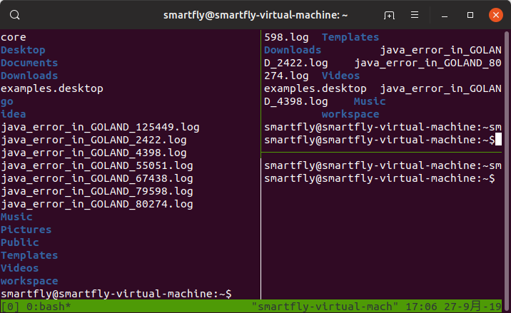

# tmux使用

tmux就是让一个终端能够分割成不同区域并执行不同命令的终端复用工具。



## ubuntu安装tmux

ubuntu安装命令：

```shell
sudo apt-get install tmux
```

## 创建删除会话

- 创建删除会话

  ```shell
  # 创建一个名称为session1的新会话，新会话自动创建一个窗口
  tmux new -s Session1
  # 输入"exit"回车后就退出了当前会话，会话也不会在后台运行。后台保存到后台运行 [ctrl]+[b]组合键，之后在单独按一下[d]
  
  # 将会话保存到后台之后，可以使用下面命令查看他们
  tmux ls
  # 将会话重新加载到前台，参数-t后面接要加载到前台的会话名称
  tmux attach -t Session1
  # 命令简写形式
  tmux a -t Session1
  # 删除会话
  tmux kill-session -t Session1
  ```

- 在会话中创建窗口

  ```shell
  # 首先重新创建刚才删除的会话
  tmux new -s Session1
  ```

  在会话中使用组合键[ctrl]+[b]，之后再单独按一下[c], 注意底部状态栏的变化，是不是在“0:bash”后面多了个“1:bash”？，这说明已经创建了一个窗口，窗口是1，名称是bash， 如果想改变当前窗口的名称，可以使用组合键[ctrl]+[b]，之后再单独按一下[,] 英文状态下的逗号，输入一个名称回车即可，如果想在不同的窗口切换，可以使用组合键[ctrl]+[b]，之后再单独按一下[0]，就切换到了0号窗口，窗口名称后面带星号(*)的是当前所在窗口，以此类推。

  在窗口中没有窗格的情况下，直接输入“exit”回车后就能删除当前窗口，如果窗口下存在窗格，依次在窗格中使用exit退出，成为单窗格的时候，再次exit就删除了当前窗口。

- 在窗口中创建窗格

  在窗口中，创建不同窗格的方法页很简单，只需要使用组合键[ctrl]+[b]，之后再单独输入[%]，就能将当前窗口划分为左右分隔的窗格：

  ```shell
  [ctrl]+[b]
  %
  ```

  如果使用组合键[ctrl]+[b]，之后再单独输入["]就能将当前窗格分隔成上下两个窗格，以此类推。

  ```shell
  [ctrl]+[b]
  "
  ```

  不同窗格之间切换

  只需要使用组合键[ctrl]+[b]，之后再单独按下键盘的上下左右键，即可在不同窗格之间切换，删除窗格只要在当前窗格输入"exit"回车即可。

## 参考资料

[使用Tmux终端复用器](https://www.qingsword.com/qing/ubuntu-tmux.html)

[Tmux 快捷键 & 速查表 & 简明教程](https://gist.github.com/ryerh/14b7c24dfd623ef8edc7)

